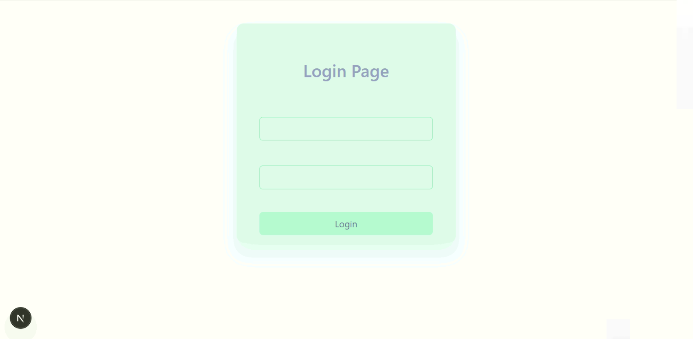

# Novo-Projeto

<div aling="center">
  
  <br/><br/>
  
  
  
  
  <br/><br/>
  <strong>Uma aplicação moderna, performática e visualmente deslumbrante construída com a stack mais atual do ecossistema React em 2025.</strong>
</div>

<br/>

## ✨ Destaques

- ⚡ **Next.js 16** com App Router e Server Components
- ⚛️ **React 19** – aproveitando as últimas features e otimizações
- 🎨 **Tailwind CSS v4** – design system ultra rápido e totalmente customizável
- 🎯 UI moderna, clean e com atenção obsessiva aos detalhes
- 🔐 Autenticação completa (Login + Cadastro)
- 📊 Dashboard rico com visualização de dados

<br/>

## 🚀 Primeiros passos

```bash
git clone https://github.com/seu-usuario/novo-projeto.git
cd novo-projeto

# Instale as dependências
npm install
# ou
yarn
# ou
pnpm install

# Rode o projeto
npm run dev
Acesse em http://localhost:3000

🖼️ Preview

LoginCadastroDashboardLoginCadastroDashboard


🛠️ Stack completa

TecnologiaVersãoPor quê?Next.js16App Router, Server Actions, Streaming SSRReact19Novas APIs, melhor performanceTailwind CSS4Engine de CSS mais rápida da históriaTypeScript5+Tipagem forte e developer experiencereact-iconslatestÍcones leves e consistentes


📝 Licença
Este projeto está licenciado sob a licença MIT – sinta-se à vontade para usar como template, estudar ou adaptar.


  Feito com 💜 por @seu-usuario
  
    ⬆ Voltar ao topo
  


